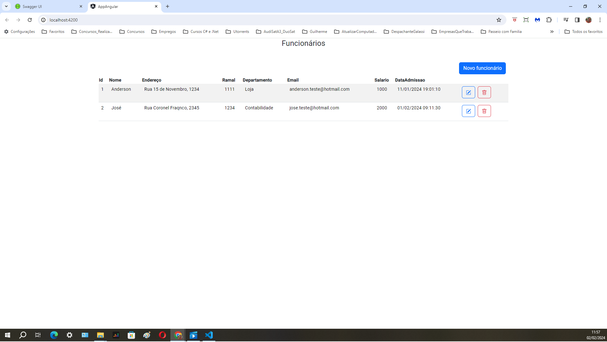
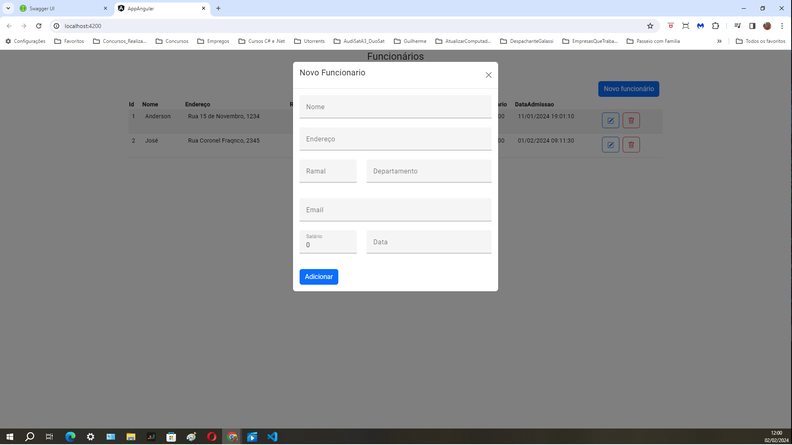
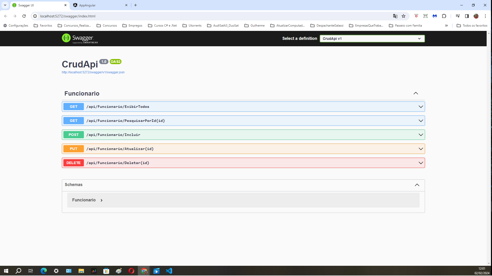

# Sistema de Controle de Tarefas 
## ( API, C#, ASP, HTML, CSS, JAVASCRIPT e ANGULAR )
 
<h1 align="center">
    
     
    
     
    
</h1>
 
## Introdução
O Sistema de Controle de Funcionários é uma aplicação desenvolvida para gerenciar tarefas, utilizando Angular 13 e BootStrap para o frontend, .NET Entity Framework 6 para o backend e SQL Server para o armazenamento de dados.

## Funcionalidades Principais
CRUD de Funcionários: Permite criar, ler, atualizar e deletar  informações dos funcionários.
## Tecnologias Utilizadas
### Frontend
Angular 13 e BootStrap: Framework JavaScript/TypeScript para construção da interface do usuário.
### Backend
.NET Entity Framework 6: ORM (Object-Relational Mapping) para interagir com o banco de dados SQL Server.
C#: Linguagem de programação utilizada para desenvolver a lógica do backend.
Banco de Dados
SQL Server: Banco de dados relacional utilizado para armazenar informações sobre tarefas, tipos de tarefa e status.
# Estrutura do Banco de Dados
## Tabelas
Funcionário: Armazena informações sobre os colaboradores, como nome, endereço, ramal, email, departamento, salário e data de admissão do funcionários.
# Uso das Ferramentas
# IDE
Visual Studio Code

# Bootstrap
Versão 5.3.2

# Angular 13
O frontend foi desenvolvido utilizando Angular 13 para criar uma interface amigável e responsiva para os usuários. Utilizamos componentes, serviços e roteamento para facilitar a navegação e interação do usuário com as informações dos funcionários.

# .NET Entity Framework 6
O backend foi construído em C# com o auxílio do .NET Entity Framework 6 para realizar operações CRUD (Create, Read, Update, Delete) no banco de dados. Foram criados modelos de dados correspondentes às tabelas do banco para mapeamento das entidades.

# SQL Server
O SQL Server foi escolhido para armazenar os dados do sistema. A tabela foi estruturada de acordo com as necessidades das entidades envolvidas (Funcionario), garantindo integridade e consistência dos dados.

## Controle de Funcionário
O sistema permite aos usuários:
Criar novos registros de funcionários, atribuindo-lhes nome, endereço, ramal, email, departamento, salário e data de admissão do funcionário. Atualizar informações dos funcionários existentes, como nome, endereço, ramal, email, departamento, salário e data de admissão. Remover registros de funcionários que não são mais necessários.

